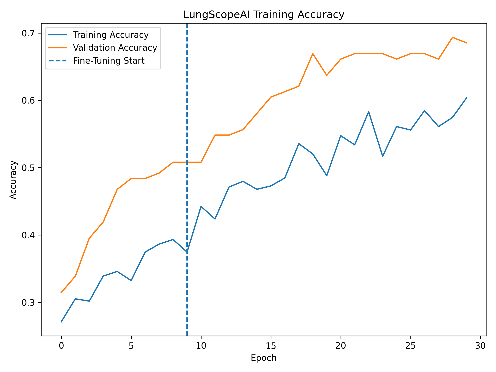

# 🫁 Lung Cancer Classification Using CT Scan Images

A Deep Learning web application that classifies lung CT scan images into four categories using **EfficientNetB0** and **Flask**.

---

## 📌 Project Overview

This project uses Transfer Learning with EfficientNetB0 to classify CT scan images into four classes:

- Adenocarcinoma
- Large Cell Carcinoma
- Normal
- Squamous Cell Carcinoma

The trained model is deployed as a Flask web application where users can upload a CT scan image and receive the predicted disease along with the confidence score.

---

## 🚀 Features

- Deep Learning based Lung Cancer Classification
- EfficientNetB0 Transfer Learning
- Flask Web Application
- Upload CT Scan Images
- Predict Disease Type
- Display Confidence Score
- Accuracy & Loss Graphs
- Confusion Matrix
- Classification Report

---

## 🛠 Technologies Used

- Python
- TensorFlow
- Keras
- EfficientNetB0
- Flask
- NumPy
- Matplotlib
- Scikit-learn
- HTML
- CSS

---

## 📂 Dataset Structure

```
dataset/
│
├── train/
│   ├── adenocarcinoma
│   ├── large.cell.carcinoma
│   ├── normal
│   └── squamous.cell.carcinoma
│
├── valid/
│   ├── adenocarcinoma
│   ├── large.cell.carcinoma
│   ├── normal
│   └── squamous.cell.carcinoma
│
└── test/
    ├── adenocarcinoma
    ├── large.cell.carcinoma
    ├── normal
    └── squamous.cell.carcinoma
```

---

## 📁 Project Structure

```
lung-cancer-classification/
│
├── app.py
├── train.py
├── predict.py
├── evaluate.py
├── README.md
├── requirements.txt
│
├── models/
│   ├── best_model.keras
│   └── lung_effnet.keras
│
├── outputs/
│   ├── accuracy.png
│   ├── loss.png
│   └── confusion_matrix.png
│
├── templates/
│   └── index.html
│
├── static/
│   ├── style.css
│   └── uploads/
│
└── dataset/
```

---

## ⚙ Installation

### Clone Repository

```bash
git clone https://github.com/yourusername/lung-cancer-classification.git
```

### Open Project

```bash
cd lung-cancer-classification
```

### Install Dependencies

```bash
pip install -r requirements.txt
```

---

## ▶ Train Model

```bash
python train.py
```

---

## 📊 Evaluate Model

```bash
python evaluate.py
```

---

## 🔍 Predict Single Image

```bash
python predict.py
```

---

## 🌐 Run Flask Application

```bash
python app.py
```

Open your browser and visit:

```
http://127.0.0.1:5000
```

---

## 📈 Model Performance

| Metric | Value |
|---------|-------|
| Model | EfficientNetB0 |
| Image Size | 224 × 224 |
| Classes | 4 |
| Test Accuracy | **66.03%** |

---

## 📷 Project Screenshots

### 🏠 Home Page


---

### 🔍 Prediction Result


---

### 📈 Accuracy Graph



---

### 📊 Confusion Matrix


---

## 📌 Future Improvements

- Improve classification accuracy
- Support additional lung diseases
- Deploy on Render or Railway
- Add Grad-CAM visualization
- Add user authentication
- Store prediction history

---

## 👨‍💻 Author

**Dhayalan**

B.Tech Artificial Intelligence & Machine Learning

GitHub: https://github.com/DhayalanSD

Portfolio: https://dhayalan-b.vercel.app/

---

## ⭐ If you like this project

Please give this repository a ⭐ on GitHub.
